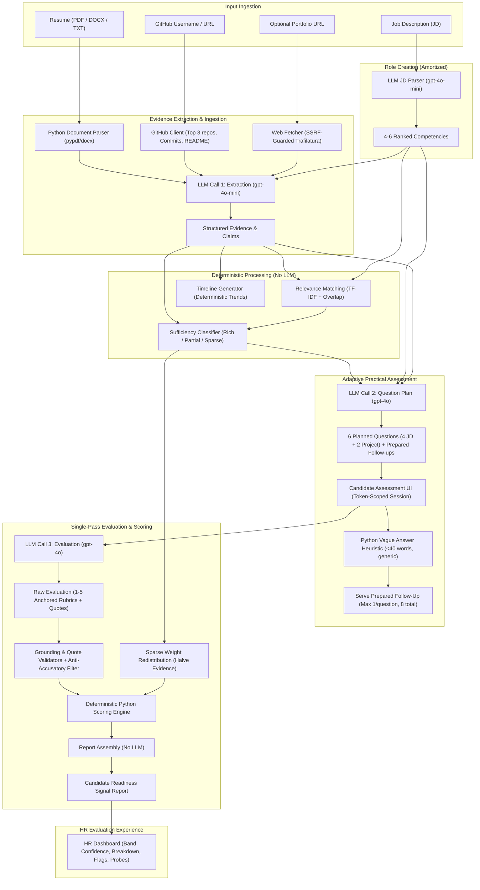

# CandidateLens: System Architecture & Data Flow

This document details the architectural design and operational pipeline of **CandidateLens**, an explainable Candidate Readiness Signal platform.

---

## 1. System Architecture Diagram

---

## 2. Key Architecture Principles

1. **3 Mandatory LLM Calls**:
   - `Call 1 (Extraction)`: High-volume, inexpensive extraction using `gpt-4o-mini`.
   - `Call 2 (Question Plan)`: Tailored 6-question practical assessment using `gpt-4o`.
   - `Call 3 (Evaluation)`: Concurrently evaluates all answers and aligns them against verified evidence in a single pass using `gpt-4o`.
   - *1 Amortized Call per Role*: Extracts 4–6 competencies once per job description.

2. **Deterministic Computation Where Appropriate**:
   - Sufficiency classification (`Rich`, `Partial`, `Sparse`), timeline observations, keyword/competency relevance, scoring math, and report narrative assembly are executed 100% in Python.
   - Guaranteed reproducibility: Storing `scoring_inputs_hash` ensures identical inputs always yield identical score and band outputs.

3. **Multi-Layered Guardrails**:
   - **SSRF Guard**: Pre-validates IP addresses and redirects against loopback, private, link-local, and cloud metadata blocks.
   - **Prompt Delimiters**: Delimiters (`<resume>`, `<github>`, `<candidate_answers>`) wrap untrusted candidate text to prevent instruction override.
   - **Grounding Validator**: Strips findings, gaps, and flags that do not resolve to valid evidence, claim, or question IDs.
   - **Language Filter**: Replaces accusatory phrasing with neutral verification terms.
